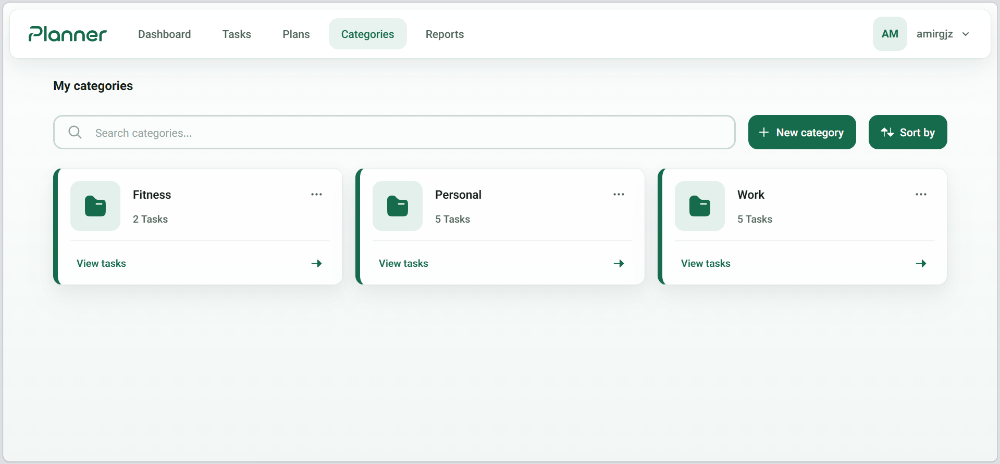
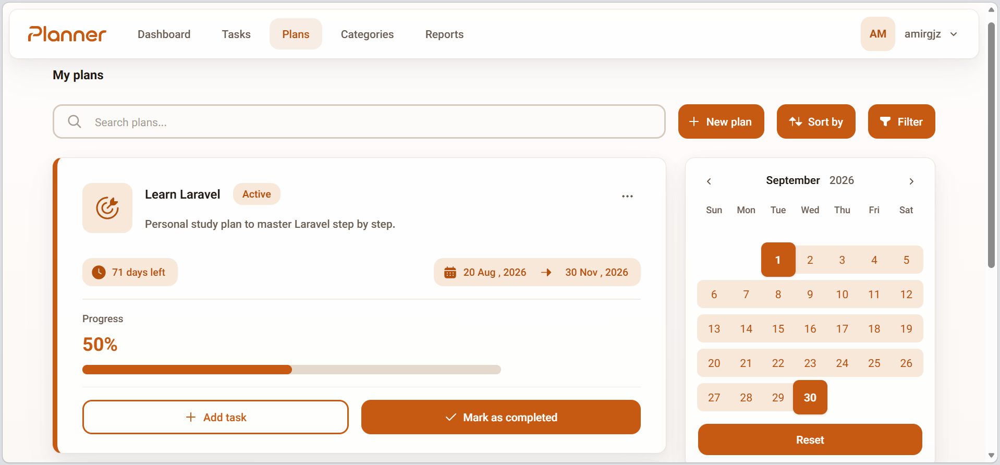

# 📋 Planner

A personal task planner that keeps you in control of your day. Assign each task to a day, group tasks into categories and plans, and see at a glance how much work every day actually carries — before you overbook yourself.

> Built with Laravel 13, Livewire 4, and Tailwind CSS — everything runs in Docker, so you don't need PHP or Node installed locally.

## ✨ Features

- **Workload-aware days** — each day shows its total estimated time, color-coded Light → Very heavy, so a day's load is always one glance away.
- **Tasks needing attention** — overdue tasks and tasks whose alarm window has started surface on the dashboard with "due today / tomorrow / in X days" labels.
- **Categories & plans** — tasks belong to a category and optionally a plan; watch plan progress climb as you check tasks off.
- **Day & range views** — browse a single day or any custom date range, with search, combined filters, and sorting.
- **Performance reports** — completion rate, estimated time, plan progress, and a per-day workload chart for any period.
- **Persian & English** — switch anytime; Persian brings the Jalali calendar, Persian digits, and full RTL layout.
- **8 color themes** — swap anytime from your profile.

## 📸 Screenshots




## 🚀 Getting Started

You only need **Docker with Docker Compose** (any recent version) and **Git** — nothing else touches your machine, the app runs entirely in containers.

### Set it up

1. Clone the project:
   ```bash
   git clone <your-repo-url> planner
   cd planner
   ```

2. Copy the production settings template:
   ```bash
   cp laravel/.env.production laravel/.env
   ```

3. Fill in 4 required values in `laravel/.env` (leave everything else as-is). If any of them is missing, the start command stops right away and tells you which one:
   - `APP_KEY` — the security key: `base64:` followed by a 32-byte key (44 characters). Generate one with:
     ```bash
     printf 'base64:%s\n' "$(openssl rand -base64 32)"
     ```
   - `DB_PASSWORD`, `MYSQL_ROOT_PASSWORD`, `REDIS_PASSWORD` — any passwords you like.

4. Start it up (the first run is slower — everything needs to download and build):
   ```bash
   ./planner up
   ```

That's it.

### Make sure it's healthy

1. Check the services:
   ```bash
   ./planner ps
   ```
   You should see 4 items — `php-fpm`, `nginx`, `mysql`, `redis` — all `Up` / `running` / `healthy`.

2. Open **http://localhost** — the app should load.
3. Register an account and log in.
4. Bonus check: **http://localhost/up** should return `200`.

## ▶️ Usage

- Open **http://localhost**, log in, and use it day to day.
- Other devices on your network work too — use your computer's IP instead of `localhost` (e.g. `http://192.168.1.20`).
- Your data is safe — updating, restarting, or rebuilding never deletes it.

**Stop, start, and reset** — every command below keeps your data safe:

| Command | What it does | When to use it |
|---|---|---|
| `./planner start` | Turns the app back on, right where it was | After you paused it with `stop` |
| `./planner stop` | Pauses the app and frees resources | Long breaks — starts back up fast |
| `./planner up` | Starts the app from the already-built version | A plain start, e.g. after `down` |
| `./planner build && ./planner up` | Builds the newest code, then starts it | After every update |
| `./planner down` | Stops everything and removes temporary stuff | A clean slate; `up` brings it back |

A few things worth keeping in mind:

- `start` / `stop` are your everyday pair. `down` / `up` are the rare, "cold" pair.
- `up` alone never pulls in new code — that's what `build` is for. Run `build` first after every update.
- **Never** run `./planner down -v` — the `-v` deletes your saved data.
- After your computer restarts, the app comes back up by itself.
- Run `./planner` with no arguments to see the full command list anytime.

**Updating:**
```bash
git pull
./planner build && ./planner up
```
Then just repeat the health check above — your data stays untouched.

## 🧑‍💻 Developing This App

Development also runs in Docker — one container has PHP, Composer, and Node all set up. You need **Docker with Docker Compose**, **Git**, and an internet connection for the first run. Your code lives in the normal project folder and is shared live with the container, so every edit shows up instantly.

### Set it up

1. Clone the project (same as above):
   ```bash
   git clone <your-repo-url> planner
   cd planner
   ```

2. Copy the dev settings template:
   ```bash
   cp laravel/.env.development laravel/.env
   ```

3. Fill in the same 4 required values as production (`APP_KEY`, `DB_PASSWORD`, `MYSQL_ROOT_PASSWORD`, `REDIS_PASSWORD`) — set `APP_KEY` before the first start, the container won't run without it.

4. Start the dev setup (first run is slow, same reason as before):
   ```bash
   ./planner-dev up
   ```

5. Open a terminal inside the container:
   ```bash
   ./planner-dev shell
   ```

6. Install the dependencies once (they live in `vendor/` / `node_modules/` and persist between restarts):
   ```bash
   composer install
   npm install
   ```

Nothing starts automatically after this — the container just waits for you to start the servers yourself.

### Start developing

The quick way: `composer run dev` starts the app server, the queue worker, and Vite all at once. Or, one at a time:

1. Start the app server (`--host=0.0.0.0` is required — Docker forwards ports to the container's network interface, so a server bound to `127.0.0.1` is invisible from your browser):
   ```bash
   php artisan serve --host=0.0.0.0 --port=8000
   ```

2. Optionally start the front-end live-reload tool (Vite already binds `0.0.0.0`, no flag needed):
   ```bash
   npm run dev
   ```

3. Open **http://localhost:8000** and register an account to try the real features.
4. Bonus check: **http://localhost:8000/up** should return `200`.

### Day-to-day

```bash
./planner-dev up
./planner-dev shell
```

Then run the two servers above. Edit code, refresh the browser — changes show up instantly, no rebuild needed. After a database change, run `php artisan migrate` inside the container. Run the tests anytime with `php artisan test` — they're fast and don't even touch the database.

**Stop, start, and reset** — same safety rules as production:

| Command | What it does | When to use it |
|---|---|---|
| `./planner-dev start` | Turns dev back on, right where it was | After you paused it with `stop` |
| `./planner-dev stop` | Pauses dev and frees resources | Long breaks |
| `./planner-dev up` | Starts dev from the already-built setup | A plain start — e.g. after `down` |
| `./planner-dev build && ./planner-dev up` | Rebuilds the tool container, then starts | Only after a setup change (rare) |
| `./planner-dev down` | Stops everything and removes temporary stuff | A clean slate; `up` brings it back |
| `./planner-dev shell` | Opens a terminal in the workspace container | Your daily entry point |

**Never** run `./planner-dev down -v` — the `-v` deletes your database. Run `./planner-dev` with no arguments to see the full list anytime.

### One settings file for both

Your `laravel/` folder only ever holds one settings file at a time — whichever environment you're currently running. Switch by copying the matching template:

- Dev: `cp laravel/.env.development laravel/.env`
- Prod: `cp laravel/.env.production laravel/.env`

Each setup keeps its own database, so switching never mixes data.

## 👤 Author

Made with ❤️ by [AmirMohammad Ganjizade](https://github.com/AmirGjzh)